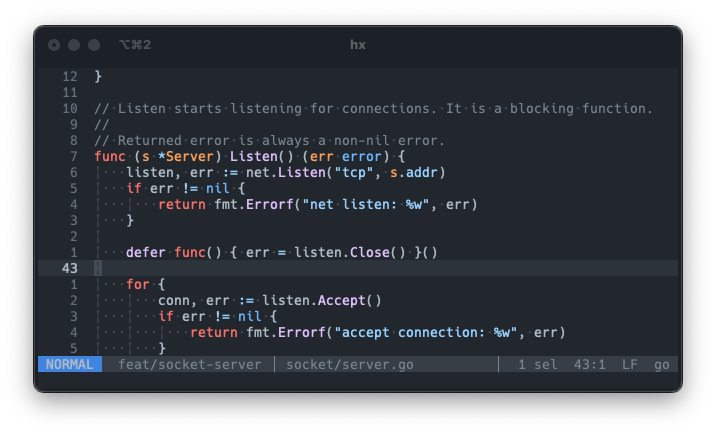

# Helix config files

[Helix](https://github.com/helix-editor/helix) is a vim-like editor,
but a lot more beginner friendly. I've tried to switch to neovim multiple
times (more than I'd like to admit), but I never actually did it.

I've randomly found Helix and now using it full time, I'd advice you to give
it a try, especially if you think that terminal/modal editing is cool,
but the (neo)vim itself is not

Also, thanks for mentioning me in the [awesome-helix](https://github.com/rajasegar/awesome-helix) repo 🎉

## Preview

_P.S. There's actually a bug in this code, can you find it?_
